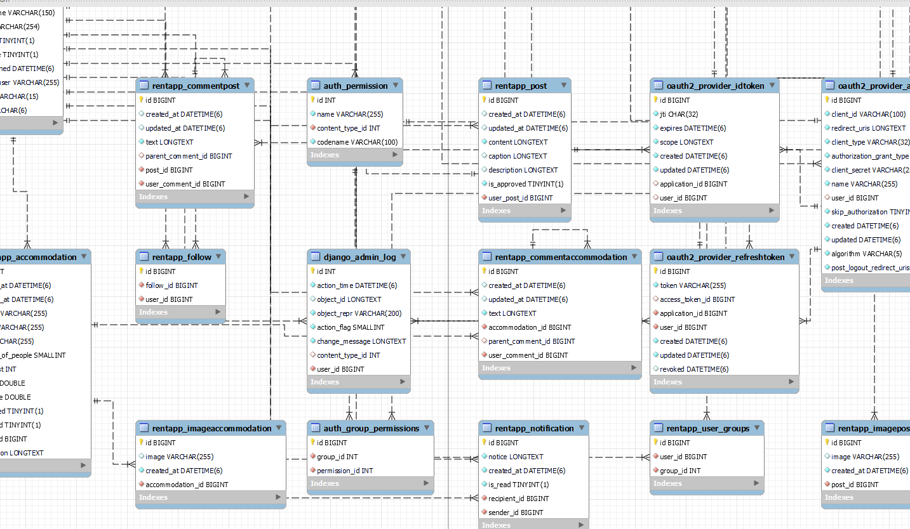

[](https://skillicons.dev)

# Program support students find accommodation

The app is built with purpose support for the students find accommodation most quickly at a location strange. When student first time has live city or street

## Table of Contents

1. [Features](#features)
2. [Database Schema](#database-schema)
3. [System Requirements](#system-requirements)
4. [Setup and Installation](#setup-and-installation)
5. [Contact](#contact)

## Feature

- **User Authentication**: Secure login and registration using OAuth2.

- **Bing Map**: Use the API for the Bing Map can get the location near with user and after sorting and get all house with distance < 10 km

- **Province** : Call API get all the streeet and province in VietName and sort it

- **Manager Account** : Manager account all the user when student register the app will check mail and need change password and upload avatar must use the app

- **Manager Post** : All hosts will post a lot of accommodation on map screen and social will admin site will be waiting admin site accept and check the post and also tentant you can do it

- **Manager Comment** : All user can comment the post from host or tentant and can reply it

- **Starts** : Will start counting all posts from the server by quarter or month

## Database Schema



## System Requirements

- Python 3.x
- Node.js and npm (for Front-end)
- Epxo Go : version 50s

## Setup and Installation

Clone repository Backend

```bah
git clone https://github.com/MinhTamNT/system-backend-accommodation.git
```

After open folder with project -> click on setting -> select project BackendSystemAccommodation -> python interperter -> select python version and create

- Open venv

```bash
.\.venv\Scripts\activate
```

- Install Package

```bash
pip install -r requirements.txt
```

- Go to Setting change

```bash
DATABASES = {
    'default': {
        'ENGINE': 'django.db.backends.mysql',
        'NAME': NAME DB,
        'USER': NAME MYSQL,
        'PASSWORD': PASSWORD MY SQL,
        'HOST': '',
    }
}
```

- Run Project

```bash
py manage.py runserver
```

Clone repository FE

```bash
git clone https://github.com/MinhTamNT/MobileAppAccmmodation
```

```bash
 npm install
```

```bash
npm start
```

## Contact

- Email : minhhtam78945@gmail.com
- GitHub : https://github.com/MinhTamNT
